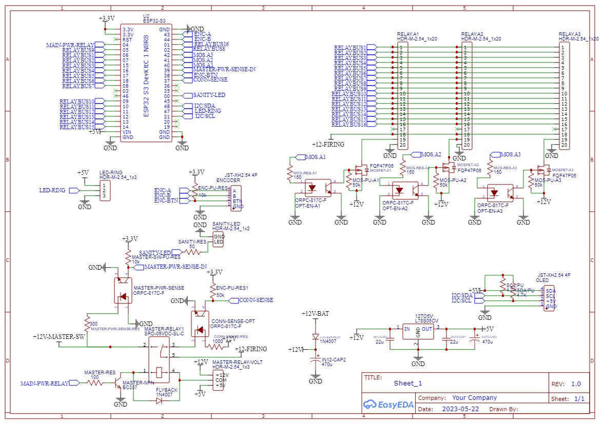

# Firework Ignition System

This system allows to ignite firework remotely using a smartphone or any other device able to access a Wi-Fi access point.
A more badass remote may be made later.

It uses of the shelves cheap 16 relays board

## Functionality

- Support up to 48 outputs
- LEDs to indicate output status
- Can detect if the connection is correctly made
- Safety switch
- Powered using 12v to 18v
- ESP32-S3 based
- OLED screen with encoder included
- Support Wi-Fi with integrated HTTP server

# PCB

# ERRATUM

PCB version 1.0 contains an error. The sanity LED is connected to GPIO0, connect it will prevent the board from booting.
Version 1.1 fix this, but version 1.0 is already in production so it needs a manual fix.
The LED SHALL be ground driven, on version 1.0 it is +3.3 driven. It's not good, it create a PULL-DOWN. It should be a pull-up.

