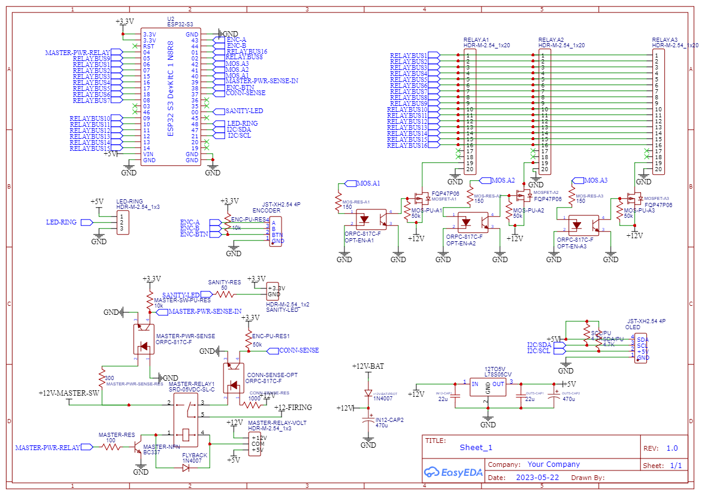

# Firework Ignition System

An ESP32-S3 based remote firework ignition controller. Up to 32 outputs (expandable to 48) can be fired individually via a Wi-Fi web interface or the onboard OLED + rotary encoder interface.

## Features

- Up to 32 outputs (48 with optional third relay board)
- Per-output RGB LED status indicator
- Continuity check before firing
- Safety master switch (hardware arming)
- 12–18 V powered
- ESP32-S3 with Wi-Fi soft-AP (and optional station mode)
- Embedded HTTP + WebSocket server (no external dependencies)
- OLED display with rotary encoder menu
- OTA firmware updates via web interface
- Configurable PWM power control and firing hold time

## Documentation

| Document | Description |
|---|---|
| [doc/hardware.md](doc/hardware.md) | GPIO pinout, relay bus architecture, PCB errata |
| [doc/architecture.md](doc/architecture.md) | Firmware architecture and component overview |
| [doc/webinterface.md](doc/webinterface.md) | WebSocket protocol and web UI |
| [doc/settings.md](doc/settings.md) | All configurable settings |
| [doc/building.md](doc/building.md) | Build, flash, and OTA instructions |
| [doc/bom.md](doc/bom.md) | Bill of materials |
| [doc/coding-style.md](doc/coding-style.md) | Coding style guide |

## Quick Start

1. Flash firmware (see [doc/building.md](doc/building.md))
2. Connect to Wi-Fi AP **FWI-XXYYZZ** (last 3 bytes of MAC, no password by default)
3. Open `http://192.168.4.1` in a browser
4. Toggle the physical master switch to arm
5. Click any green output button to fire

## PCB Errata — v1.0

PCB v1.0 has two errors fixed in v1.1:

- **GPIO 0 sanity LED**: On v1.0 the LED is 3.3 V-driven instead of ground-driven, creating a pull-down that prevents booting. Leave it unconnected on v1.0.
- **Pins 47/48 swapped**: On v1.0, SDA (I2C) and LED ring (WS2812B) are swapped. If using v1.0, swap the wires:
  - GPIO 47 → LED ring
  - GPIO 48 → SDA
