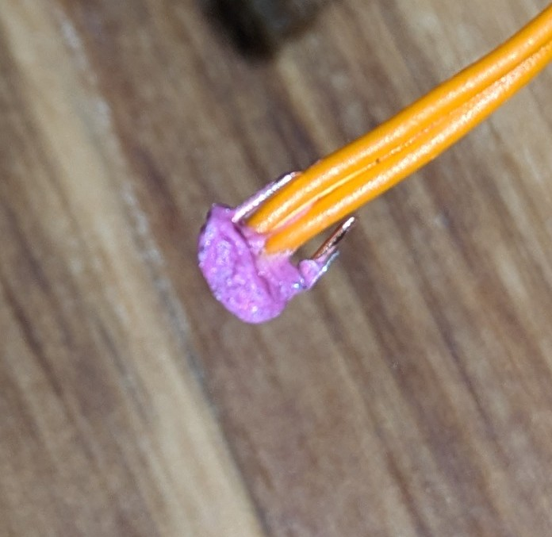

# Formula #2

URL: https://www.youtube.com/watch?v=SUDgH0nD_T0

Basically, we destroy a few matches using a pilar and mix the resulting powder with arabic gum powder and magnesium.

## Prepare wire

- Remove 4 mm of insulation from the fire
- Bend the cooper at 30 degrees angle relative to each others
- Put some bridge wire between the two, roll as much as needed around cooper to be sure it hold in place

## Powder mix instructions

- Takes 2 wood matches, crush them with a pilar until it become a powder.
- Scrape some magnesium
- Mix 1/4 of magnesium relative to match powder.
- Add approximately 2% of the volume in arabic gum powder
- A few drop of water, until you get a good consistency.

Add the mixture between the two cooper part and the bridge wire.

## Results

